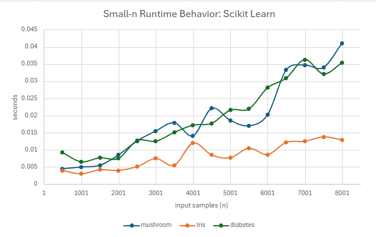
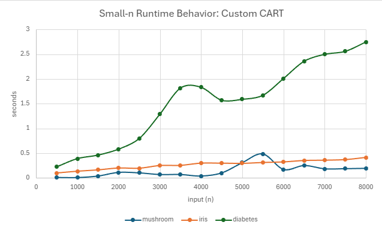
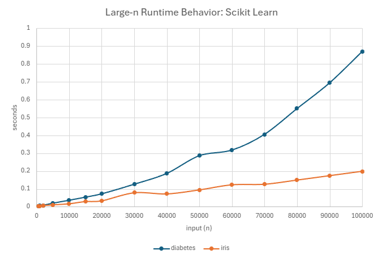
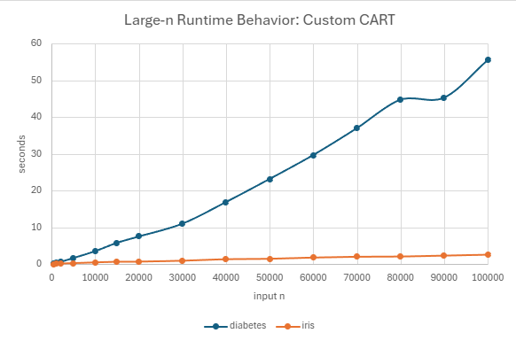
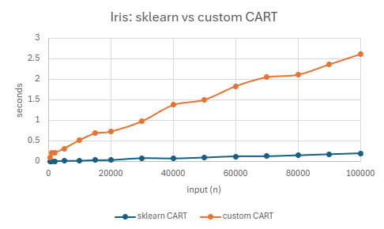
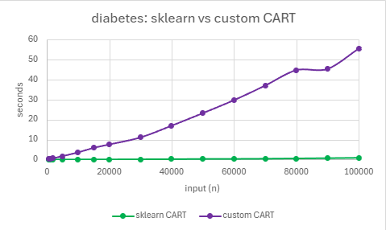
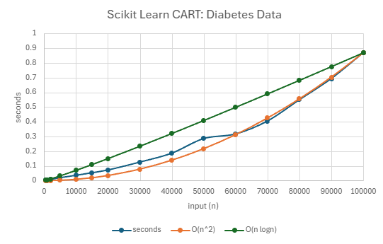
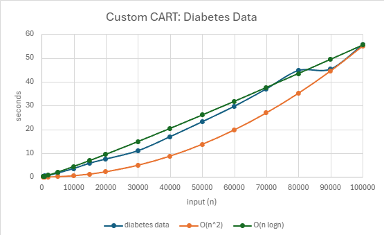
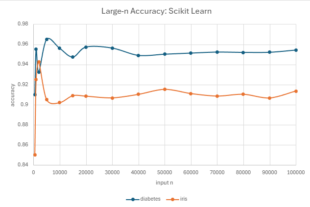
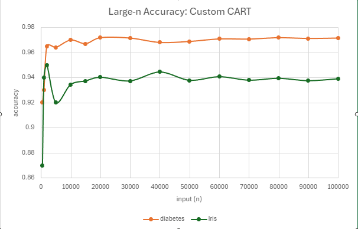

# 5008 Final Research Paper
* Name: Rowan Lowden
* Semester: Summer 2025
* Topic: Decision Tree Algorithm

## Introduction/Overview

In this report, I examine decision tree algorithms, a broad class of supervised learning methods used in machine learning. Decision trees represent models as hierarchical structures, where data is recursively partitioned into smaller subsets based on measures of split quality. They are widely applied to both classification and regression tasks due to their simplicity, interpretability, and ability to handle both categorical and numerical data[^3]. A decision tree consists of a root node, branches, internal decision nodes, and leaf (terminal) nodes. The root node has no incoming branches, only outgoing branches leading to decision nodes that apply specific conditions to split the data into increasingly homogeneous subsets until a terminal node is reached[^1].


Classification and Regression Trees (CART) are a specific implementation of decision tree algorithms designed for both classification and regression problems. In classification, CART predicts categorical outcomes, for example, determining whether a mushroom is edible or poisonous based on attributes such as color, size, and odor[^3]. In regression, it predicts continuous values, such as estimating house prices from features like square footage and location[^4]. The algorithm recursively selects the most informative feature at each node using a predefined criterion (Gini impurity for classification, variance reduction for regression) to optimize split quality[^5]. One of CART’s key advantages is its interpretability; its explicit, rule-based structure makes it possible to trace each decision path, making it especially valuable in applications ranging from medical diagnosis to economic forecasting and weather prediction, etc [^6].

This report provides a focused analysis of decision tree algorithms, covering their historical development, theoretical foundations, practical implementations, and empirical performance. It begins with a brief history and survey of real-world applications, followed by an explanation of data-splitting criteria and an analysis of computational complexity using CART pseudocode. The implementation section compares two approaches: a scikit-learn `DecisionTreeClassifier` and a custom CART algorithm applied to three datasets. An empirical analysis evaluates model accuracy and scalability across varying dataset sizes and feature counts. The report concludes with a sumamry including key and implementation challenges.

### Algorithm Development 
Decision Trees have a rich history in machine learning, with origins dating back to the 1960s. One of the earliest methods, Hunt’s Algorithm, was developed to model human inductive learning, replicating how people make decisions based on prior experiences. Introduced by J. Hunt and colleagues, this work laid the foundation for modern decision tree methods. [^7]

In 1986, Ross Quinlan introduced the ID3 algorithm, which used information gain to split data at each node, pioneering recursive binary splitting for classification. [^3] Quinlan later improved this approach with the C4.5 algorithm in 1993, adding pruning to reduce overfitting, handling both continuous and discrete attributes, and using gain ratio for more accurate splits.[^5] Around the same time, Breiman et al. developed the CART (Classification and Regression Trees) algorithm, which employed Gini Impurity for classification and Mean Squared Error for regression. [^4]

Today, Decision Trees remain a cornerstone of machine learning and have inspired powerful ensemble methods such as Random Forests and Gradient Boosting, which combine multiple trees to enhance predictive accuracy and robustness. [^6].

## Application

Decision trees are widely used across scientific fields beyond computer science due to their ability to identify key predictive variables. They are especially valuable in high-stakes domains such as healthcare, environmental monitoring, and resource management, where transparency and trust in model outputs are critical [^9] [^10] [^11]. By producing rule-based decisions and highlighting the most influential features, decision trees not only deliver accurate predictions but also explain the reasoning behind them which enable insight driven interventions. Below I summarize 3 recent research studies I found interesting that utlized decision tree models. 

The first study, by Lu & Ma (2020), developed two decision-tree-based models for short-term water quality predictions in Oregon’s Tualatin River. Using hourly environmental data such as temperature, dissolved oxygen, pH, conductivity, turbidity, fluorescence, they applied CEEMDAN for data cleaning before training Random Forest and Gradient Boosting models. Compared with conventional baselines, their hybrid decision tree model achieved stable, accurate forecasts, enabling proactive management actions such as anticipating low-oxygen events or turbidity spikes [^14].

The second study, by Elhazmi et al. (2022), addressed the urgent need for ICU triage tools during the COVID-19 pandemic. Conducted across 14 hospitals in Saudi Arabia, the study trained a C4.5 decision tree on clinical data from 1,468 critically ill patients to predict 28-day mortality. The model incorporated variables such as intubation status, vasopressor use, oxygenation ratio, age, and gender, achieving 73.1% accuracy. Its transparent, rule-based structure allowed clinicians to quickly assess patient risk at the bedside, offering clear interpretability compared to traditional logistic regression [^12].

The third study, by Hajihosseinlou, Asghari, and Shirvani (2023), applied Light Gradient Boosting Machine (LightGBM) to mineral exploration in Iran’s Varcheh district. Analyzing geological, geochemical, and remote sensing data, the model achieved 92% precision in identifying known mineral deposits within 10% of the mapped area. The decision-tree-based approach significantly reduced exploration costs by focusing efforts on high-prospect zones, demonstrating its value in economic geology [^13].

From forecasting river conditions to ICU triage and mineral exploration, decision trees demonstrate versatility, strong predictive power, and clear interpretability. Their capacity to handle diverse data types, model complex relationships, and provide actionable rules makes them an indispensable tool for both scientific research and real-world decision-making.

## Theoretical Analysis

### Splitting Data: Entropy, Information Gain, and Gini Impurity

To understand the performance of decision tree algorithms such as CART, it is important to examine how they determine the best feature to split the dataset at each step. The goal of any decision tree is to create splits that produce increasingly homogeneous subsets, improving classification or regression accuracy. Different decision tree algorithms use different measures to guide these splits. ID3 and C4.5 use entropy and information gain, while CART, the focus of this project, uses Gini Impurity for classification.

Entropy measures the amount of disorder in a dataset and is fundamental to information theory. It is calculated as:

$$
\text{Entropy}(S) = - \sum_{c \in C} p(c) \log_2 p(c)
$$

* $S$ is the dataset
* $c$ is the classes in the set $S$. 
* $p(c)$ represents the proportion of data points that belong to class $c$ 

Calcuated entropy values fall between 0 and 1 with low entropy or disorder in a set equaling 0 and if a set has samples of half one class and half another the entropy will be the highest at 1. In order to find the optimal split, the decision tree algorithm will find the best feature to split the dataset with the smallest amount of entropy. 

Information gain measures the reduction in entropy after a dataset is split on a feature. If an attribute has high information gain it will produce the best split which means it is excelling at classifying the training data according to the target classification. It is represented by the following formula: 

$$
\text{Information Gain}(S, a) = \text{Entropy}(S) - \sum_{v \in \text{Values}(a)} \frac{|S_v|}{|S|} \cdot \text{Entropy}(S_v)
$$

* $a$ represents attribute being split
* Entropy$(S)$ is the entropy dataset
* $\frac{|S_v|}{|S|}$ is the proportion of the subset with a specific attrbution to the entire dataset.

For example, if we consider a dataset with 100 mushroom samples and 60 are edible while 40 are poisonous, the entropy is: 

$$
\text{Entropy}(S) = -0.6 \log_2(0.6) - 0.4 \log_2(0.4) = 0.970
$$

If the algorithm splits the data on odor. If 30 mushrooms have a foul odor and all of them are poisonious (entropy = 0) and the remaining 70 have mixed classification (60 edible and 10 poisonous), the entropy would be calcauted as followed

$$
\text{Entropy}(S_{\text{odor} \neq \text{foul}}) = -\left(\frac{60}{70}\right) \log_2 \left(\frac{60}{70}\right) - \left(\frac{10}{70}\right) \log_2 \left(\frac{10}{70}\right)
$$

$$
\text{Entropy} = -0.857 \log_2(0.857) - 0.143 \log_2(0.143) \approx 0.863
$$

With an the entropy caculations of 0 and 0.863. The calculated information gain from splitting on the odor feature would be:

$$
\text{Gain}(S, \text{odor}) = \text{Entropy}(S) - \left( \frac{30}{100} \cdot 0 \right) - \left( \frac{70}{100} \cdot 0.863 \right)
$$

$$
\text{Gain}(S, \text{odor}) = 0.970 - 0 - 0.604 = 0.366
$$

This means that splitting by odor is a significant reduction in entropy and reduces the impurity, therefore the decision tree algorithm would likely select this as the first feature to split on. 

Gini impurity, used by CART, is a probability calculation signifiying if a random data point is incorrectly classificed in a dataset. Similar to entropy, if a set $S$ is pure and all one class (edible) then the gini impurity would be 0. Unlike entropy, the gini impurity maximum depends on the number of classes. If there are 2 classes, like the mushroom example, the maximum gini impurity is 0.5. The formula for gini imputiy is as follows:

$$
\text{Gini}(S) = 1 - \sum_{c \in C} \left(p(c)\right)^2
$$

* $C$ is the set of classes
* $p(c)$ is the probability of a datapoint bellonging to class $C$. 
* $\sum_{c \in C}$ the sum of $c$ within $C$

Entropy and Gini Impurity are both measures of impurity used by decision tree algorithms to decide where to split the data. Entropy is based on information theory and involves logarithmic calculations, while Gini Impurity is simpler and faster to compute, measuring the probability of misclassification. The `DecisionTreeClassifier` in scikit-learn defaults to using Gini Impurity because it is computationally efficient and typically results in similar split decisions as entropy.

Understanding how decision trees choose splits using entropy, information gain, and Gini impurity provides valuable insight into the logic behind the algorithm. These measures ensure the model reduces impurity at each step, gradually organizing the dataset into more homogenous subsets. By visualizing and calculating these values in examples like the mushroom dataset, we gain a clearer picture of how the algorithm operates under the hood. This foundation helps contextualize later analysis of runtime complexity, scalability, and model performance across different dataset.


### Time and Complexity: Big O

Understanding the time and space complexity of the CART Decision Tree algorithm is essential for evaluating its scalability and performance. CART builds decision trees using a recursive, top-down, divide-and-conquer approach, classifying input data based on feature values. At each internal node, the algorithm uses a greedy search to find the feature and threshold that yield the greatest reduction in impurity, measured with Gini Impurity as described earlier. [^1] 

The training time of a decision tree depends on the number of samples $n$, the number of features $m$, and the depth of the tree. The table below summarizes the theoretical time and space complexities for the best, average, and worst cases considered in this report. A detailed explanation and pseudocode follow.

| Case |  Time Complexity | Space Used | 
| :-- | :-- |  :-- |
| Best | $O(n \cdot m \cdot \log n)$ | $O(n)$ |
| Average | $O(n \cdot m \cdot \log n)$ | $O(n)$ |
| Worst | $O(n^2 \cdot m)$ | $O(n)$ |


### Pseudocode: CART Algorithm 

To better understand where the logarithmic depth and nested evaluations come from, consider the following simplified pseudocode for growing a binary decision tree using the CART algorithm: [^8]:

```
Initialize active_nodes = { root containing all samples }
depth = 0

while active_nodes is not empty:
    next_active_nodes = {}

    for each node in active_nodes:
        if stopping_condition(node):
            make_leaf(node)
        else
            (best_feature, threshold) = find_best_split(node.data) //gini impurity
            (left_data, right_data) = split(node.data, best_feature, threshold)
            create left_child, right_child
            assign data
            add left_child and right_child to next_active_nodes

    active_nodes = next_active_nodes
    depth = depth + 1
end while

```
The recursion depth of the tree corresponds to the number of iterations of the outer `while` loop not being empty and depends on how balanced the splits are. In the best and average cases, the dataset is split evenly at each step, leading to a balanced binary tree with a depth proportional to $logn$ In the worst case, where splits are highly unbalanced and a split removes only one sample, the depth can grow to $n$. This depth is important because it determines the number of times the algorithm must descend into child nodes during training.

Within each iteration of the `while` loop, the inner `for` loop calls `find_best_split`(node.data) for each active_node at the current depth. This function evaluates all features to determine the optimal split, which may require sorting or scanning through the data at that node. If sorting is nessecary the implementation will require $O(n \log n)$ operations per feature  or $O(n)$ if only scanning is performed. Because every node at a given depth collectively processes the entire dataset, the total amount of work across all levels in a balanced tree sums to $O(n \cdot m \cdot \log n)$.[^4]

In the worst-case scenario, where the tree becomes a chain of nodes, the number of node evaluations grows quadratically, resulting in a time complexity of $O(n^2 \cdot m)$. Practical implementations, such as scikit-learn’s CART-based `DecisionTreeClassifier`, typically use stopping conditions such as maximum depth or minimum samples per split to prevent such inefficient growth. [^4]

The space complexity of a decision tree is $O(n)$ across all cases. This is because a binary tree with $n$ samples can have at most $2n - 1$ nodes, and each node stores a small, constant amount of information such as the split feature, threshold, and label distribution. While deeper trees require more internal nodes, the total memory required still scales linearly with the size of the dataset. [^3]

### Proof of Correctness: Loop of Invariant

**Loop Invariant:** At the start of each iteration of the `while` loop at depth `d`:

1. Every node in `active_nodes` contains samples that match its path of previous splits.
2. All samples appear in exactly one node, they are never duplicated or lost. 
3. For all nodes still in `active_nodes`, if it terminated right now, it would be labeled based on the current samples the node contains. 
4. A node already marked as a leaf has a final classification label which match all other samples in the node. 

**Initialization:** At `depth = 0`, before the first loop iteration, `active_nodes = {root}`, which contains all samples of the given dataset. No splits have occured, so the invariant holds. 

**Maintenance:** Assume the invariant holds at the start of each iteration.
For each node in `active_nodes`, if the stopping condition is met, a leaf node is created and a label is assigned without altering the data, so the invariant holds. If the node is split, `split(node.data, best_feature, threshold` partitions the node’s samples into `left_data` and `right_data` without duplication or loss of data. Each child node inherits exactly one subset of data and replaces the parent in `active_nodes.` Their data still matches the path of splits leading to them. Existing leaves remain correct and the invariant still holds for the next iteration.

**Termination:** The loop ends when `active_nodes` is empty. By the invariant, every sample has followed a unique path from the root to exactly one leaf, and no sample is misassigned. Therefore, the algorithm correctly represents the tree's partitioning and can classify any sample consistently.

## Implementation

For this project, I used Python due to its robust ecosystem of machine learning libraries. I relied on pandas and numpy for data preprocessing, matplotlib for tree visualzation, excel for graphing, scikit-learn for implementing one version of the Decision Tree algorithm, and a second implmentation of CART algorithm from scratch. This includes training the model and evaluating performance. I worked with 3 datasets from Kaggle:

* Mushroom dataset (~8000 samples, 22 features) [^17]
* Iris dataset (100,000 samples, 4 features) [^15]
* Clinical diabetes dataset (100,000 samples, 16 features) [^16]

I began with the mushroom dataset, but due to its smaller size, I added larger datasets to better explore the algorithm's runtime and scalability as well as exploring what it means to have different number of features for classification. 

### DecsionTreeClassifer (sci-kit learn)

To build and train the model, I used scikit-learn’s built-in `DecisionTreeClassifier`, a common implementation of the CART (Classification and Regression Tree) algorithm. After researching popular workflows, I found this method was widely used in machine learning tasks. I used functions such as `train_test_split()` to split data, and `accuracy_score()` and `classification_report()` to evaluate how well the model performed on the test set. [^20] These tools allowed me to quickly understand the model's performance and adjust parameters when necessary. The decision tree algorithm provided an interpretable model that could accurately classify data with high reliability (accuracy values available in the empirical analysis). [^18]

A key challenge was learning how to structure the machine learning workflow, especially understanding how to encode categorical features, split data correctly, and interpret performance metrics. Sklearn’s built-in tools made it easier to get reliable results quickly and focus on understanding how decision trees work under the hood. This project gave me hands-on experience applying a decision tree algorithm across datasets of varying size and complexity using a professional workflow.

Below I walk through my code to show my a implmented these built in tools to learn and analyze decision tree algorithm. 

```python
def split_data(X, y, test_size=0.2):
    return train_test_split(X, y, test_size=test_size, random_state=42)

```
This function splits the feature set (X) and labels (y) into training and testing subsets. It uses an 80/20 split by default and sets a fixed random_state to ensure reproducible results.

```python

def train_decision_tree(X_train, y_train):
    clf = DecisionTreeClassifier(random_state=42)
    clf.fit(X_train, y_train)
    return clf 
```

This function creates and trains a scikit-learn `DecisionTreeClassifier` on the training data. The random_state is set for reproducibility. The .fit() method builds the tree by recursively splitting the dataset based on feature values to reduce Gini impurity.

After training the model using `DecisionTreeClassifier`, I visualized a simplified tree by setting a `max_depth` of 5 and classified the mushroom dataset. A depth of 5,  makes the tree small enough to interpret while still showing how the model selects features and splits based on them. Each node displays the splitting condition, number of samples, Gini impurity, and the predicted class. 


This visual shows how the decision tree identifies patterns in the data. For example, in the mushroom dataset, the model may split first on odor, which has high predictive value, followed by stalk, qualties of the cap, or other important features. The darker the color the more confident the model is in the predicition while the lighter color has more mized samples (edible and poisinous) and a higher Gini impurity. The blue node predicts poisonous while the orange predicts edible mushrooms. 

```python 
def evaluate_model(model, X_test, y_test):
    y_pred = model.predict(X_test)
    accuracy = accuracy_score(y_test, y_pred)
    print(f"Accuracy: {accuracy}")
    print("Classification Report:")
    print(classification_report(y_test, y_pred))
    return accuracy
```
This function uses the trained model to predict labels on the test set, then evaluates its performance using accuracy_score and classification_report. It prints and returns the overall accuracy, and displays precision, recall, and F1-score for each class.

```python

def time_model_training(X, y, sample_sizes):
    results = []

    for size in sample_sizes: #loop through the sample sizes
        #sample of the data
        X_sample = X[:size]
        y_sample = y[:size]

        #split into the train and test sets
        X_train, X_test, y_train, y_test = train_test_split(X_sample, y_sample, test_size=0.2, random_state=42)
        
        #train and time the model
        start = time.time()
        model = train_decision_tree(X_train, y_train)
        end = time.time()
        
        #evalulate the model with accuracy score
        accuracy = evaluate_model(model, X_test, y_test)

        #timing 
        duration = end - start
        #save results
        results.append((size, accuracy, duration))

    return results
```
This function evaluates how the model’s training time and accuracy change as the dataset grows. For each sample size, it splits the data, trains the model, records how long training takes, evaluates accuracy, and stores the results for empirical analysis.

### CART Algorithm (from scratch)

You can find the original code for this in [CART](cart.py) and [Main](cart_main.py).

Although I did not initially plan to implement two versions of the decision tree algorithm, starting with scikit-learn’s built-in DecisionTreeClassifier gave me a strong foundational understanding of the workflow, key parameters, and performance evaluation. This baseline experience made it much easier to translate the theory into code when I later implemented the CART (Classification and Regression Tree) algorithm from scratch in Python. My custom version uses its own Node structure and recursive tree-building logic to split datasets based on Gini impurity. Unlike the scikit-learn implementation, which abstracts away these details, my version explicitly handles each step: choosing the best split, partitioning the data, and assigning labels to leaf nodes.

The foundation of my implementation is the Node class, which represents both decision and leaf nodes:

```python 
""" Defines the Node class for the Decision Tree. Either a decision node or a leaf node."""
class Node:
    def __init__(self, feature=None, threshold=None, left=None, right=None, *, value=None):
        self.feature = feature          # index of feature to split on
        self.threshold = threshold      # value of the split
        self.left = left                # left subtree/child
        self.right = right              # right subtree/child
        self.value = value              # class label if it's a leaf
        
    # If value is not None and has no children, this is a leaf node
    def is_leaf_node(self):
        return self.value is not None

```
Each node stores the feature index and threshold used for splitting, references to left and right child nodes, and a value if the node is a leaf. Internal nodes direct the flow of data down the tree, while leaf nodes hold the final class label.

The training process begins with the `fit()` method, which calls the recursive `_build_tree()` fucntion. This function is responsible for creating the tree by splitting the dataset until stopping criteria are met:

```python
def fit(self, X, y):
    self.root = self._build_tree(X, y)

 def _build_tree(self, X, y, depth=0): 
        num_samples, num_features = X.shape # Get the number of samples and features
        num_labels = len(np.unique(y)) # countsof unique labels in dataset

        # stopping criteria to make a leaf node
        # If max depth is reached, or if all samples belong to the same class, etc
        if (depth >= self.max_depth or num_labels == 1 or num_samples < self.min_samples_split):
            leaf_value = self._most_common_label(y)
            return Node(value=leaf_value)

        # Find the best feature and threshold to split on based on GIni impurity
        best_feat, best_thresh = self._best_split(X, y)
        if best_feat is None:
            return Node(value=self._most_common_label(y))

        # Create a decision node with the best feature and threshold
        left_idxs = X[:, best_feat] < best_thresh
        right_idxs = ~left_idxs # Get the indices for left and right splits

        # Recursively build the left and right subtrees
        left = self._build_tree(X[left_idxs], y[left_idxs], depth + 1)
        right = self._build_tree(X[right_idxs], y[right_idxs], depth + 1)
        # Return a new Node with the best feature and threshold, and the left/right subtrees
        return Node(feature=best_feat, threshold=best_thresh, left=left, right=right)

```
At each node, `_build_tree()` determines whether further splitting is possible based on tree depth, sample size, or class purity. If so, it finds the best split and recursively builds the left and right subtrees. If not, it creates a leaf with the most common class label for that subset.

Selecting the best split is done in `_best_split()`, which examines all feature–threshold combinations and calculates their Gini gain:

```python
    """ Finds the best feature and threshold to split the data based on Gini impurity. """
    def _best_split(self, X, y):
        best_gain = -1 # Initialize best gain to a low value so any will be better
        best_feat, best_thresh = None, None

        for feature_index in range(X.shape[1]):
            thresholds = np.unique(X[:, feature_index])
            #test each threshold for the current feature
            for threshold in thresholds:
                # Create left and right splits based on the threshold
                left_idxs = X[:, feature_index] < threshold
                right_idxs = ~left_idxs

                # If either split is empty, skip this threshold
                if len(y[left_idxs]) == 0 or len(y[right_idxs]) == 0:
                    continue

                # Calculate the Gini gain from this split
                gain = self._gini_gain(y, y[left_idxs], y[right_idxs])

                # If this gain is better than the best found so far, update best values
                if gain > best_gain:
                    best_gain = gain
                    best_feat = feature_index
                    best_thresh = threshold

        return best_feat, best_thresh
```
This method evaluates each possible split and chooses the one that produces the largest reduction in impurity. While this approach is very computationally expensive by testing all option, it ensures that the split chosen is optimal for the current node.

The impurity of a set and the gain from splitting it are calculated using `_gini()` and `_gini_gain()`:

```python

   """ Calculates the Gini impurity for a set of labels (y). """
    def _gini(self, y):
        counts = np.bincount(y) # Count occurrences of each class label
        probs = counts / len(y) # Calculate probabilities of each class
        return 1 - np.sum(probs ** 2) #gini formula

    """ Calculates the Gini gain from a split. How much the Gini impurity is reduced by splitting the data from parent to child. """
    def _gini_gain(self, parent, left, right):
        weight_left = len(left) / len(parent) #proportion of samples in left split
        weight_right = len(right) / len(parent) #proportion of samples in right split
        return self._gini(parent) - (weight_left * self._gini(left) + weight_right * self._gini(right))

```
The Gini impurity measures how mixed the classes are in a node, and the gain measures how much a split reduces impurity, weighted by the size of the child nodes.

Once the tree is trained, predictions are made by starting at the root and following split conditions down to a leaf. This is handled by `predict()` and `_traverse_tree()`:

``` python

    """ Predicts the class labels for a set of samples. Uses the trained tree to make predictions. """
    def predict(self, X): # X is a 2D NumPy array of samples, collects predicitions to compare with true labels
        return np.array([self._traverse_tree(x, self.root) for x in X])

    """ Traverses the tree to make a prediction for a single sample for the predict fucntion. """
    def _traverse_tree(self, x, node):
        if node.is_leaf_node():  # If it's a leaf node, return the class 
            return node.value
        if x[node.feature] < node.threshold: # if the feature value is less than the threshold, go left
            return self._traverse_tree(x, node.left)
        else: # if the feature value is greater than or equal to the threshold, go right
            return self._traverse_tree(x, node.right)

```
For each sample, the traversal logic checks the relevant feature against the node’s threshold, then moves left or right accordingly until a leaf is reached. The label stored at that leaf becomes the prediction. This is helpful for calculating the accuracy score using the built in sci-kit learn tool.

This from-scratch CART implementation mirrors the theoretical process of decision tree construction: recursively partitioning the feature space to maximize class separation at each step. It also made the algorithm’s trade-offs more tangible for me to understand. For example, the impact of maximum depth, number of features, and the computational cost of evaluating all possible thresholds.


## Empirical Analysis

To evaluate the performance of the Decision Tree classification algorithm, I conducted experiments using three datasets from Kaggle: a Mushroom dataset (~8,000 samples, 23 features) [^17], a Iris dataset (100,000 samples, 4 features) [^15], and a clinical diabetes dataset (100,000, 16 features) [^16]. The classification tasks involved predicting whether a mushroom is edible or poisonous, identifying an iris species, and determining whether an individual has diabetes. This section provides empirical results of runtime behavior across varying sample sizes and different CART implmentations, highlights scalability trends, and supports the algorithm's theoretical $O(n \cdot \log(n))$ time complexity. I also report classification accuracy using Python’s built-in `accuracy_score` function to assess model effectiveness.

All data used to make the following graphs is in the attached excel workbook. 

[Final Research Paper Workbook](results/5008%20final%20project%20graphs(CART).csv)

### Small-n Runtime Behavior


To evaluate the time complexity of the Decision Tree algorithm, I measured training time as the number of input samples increased across three datasets. The first set of graphs focus on smaller sample sizes (n ≤ 8000), highlighting early runtime behavior and variability between datasets. 



This graph shows the small-n runtime behavior (n ≤ 8000) for the scikit-learn implementation. All three datasets exhibit roughly linear scaling in this range, with the Iris dataset consistently training the fastest due to its low feature count of 4. The Mushroom and Diabetes datasets take slightly longer, with the Diabetes dataset showing a steady increase in runtime proportional to n, likely due to its higher dimensionality of 16 features. Minor fluctuations in the curves can be attributed to system variability and caching effects at small sample sizes.



This graph also shows runtime behavior for small-n, but for the custom CART implementation. Compared to scikit-learn, the custom algorithm exhibits significantly higher runtimes, especially for the Diabetes dataset, which grows rapidly even at small n due to its 16 features and less optimized split-finding method. The Iris and Mushroom datasets remain much faster, with runtimes under 0.5 seconds, though still slower than the scikit-learn implementation. The pronounced spikes and variability in the Diabetes curve suggest additional overhead from repeated feature evaluations and lack of algorithmic optimizations present in scikit-learn.

### Large-n Runtime Behavior
The second graph extends this analysis to larger datasets (up to 100,000 samples) using the Iris and Diabetes data to examine scalability and validate the expected quasi-linear growth pattern of $O(n \cdot \logn)$.



This graph shows the runtime behavior for large input sizes up to 100,000 samples, using the scikit-learn CART implementation. Both datasets show smooth, predictable increases in runtime, with the Diabetes dataset increasing more steeply because it has more features (16) compared to Iris (4). Even at the largest input size, runtimes stay under one second, showing that the scikit-learn version is highly efficient and scales well.




This graph also shows the runtime behavior for large input sizes, but using the custom CART implementation. The Iris dataset remains consistently low in runtime due to having only four features, but the Diabetes dataset increases sharply, exceeding 50 seconds at the largest input size. This steep growth reflects the less optimized splitting strategy in the custom implementation, which becomes significantly slower as the number of features and samples increases.

### Implmentation Comparision: Scikit learn vs Custom 

The following figures compare the runtime performance of the same dataset when processed with two different implementations of the CART algorithm: Scikit-learn’s optimized version and a custom implementation. These side-by-side results illustrate the significant difference in scalability and execution time, particularly as input sizes grow.



For the Iris dataset, both algorithms show increasing runtime as the number of samples grows, but the custom CART is consistently slower. While Scikit-learn processes 100,000 samples in under 0.25 seconds, the custom implementation takes over 2.5 seconds, indicating significantly less efficient scaling.



The performance gap is even more pronounced with the Diabetes dataset. Scikit-learn completes training in under 1 second for the largest input size, whereas the custom CART exceeds 55 seconds. This suggests that the custom algorithm has much higher computational overhead and does not scale efficiently for larger datasets.

### Runtime Complexity: Measured vs. Theoretical Growth

To further evaluate algorithm performance, I created visuals comparing the measured runtimes for the diabetes dataset using the Scikit-Learn CART and the custom CART implementations against theoretical growth curves. For each dataset, I calculated trendlines for $O(n^2)$ and $O(n log n)$ using constants derived from the measured runtimes ($k$ values fitted to the largest input size). These plots highlight how each implementation scales for larger datasets, allowing direct comparison between the actual measurements and the expected theoretical complexity.



 The measured runtimes (blue) align closely with the $O(n^2)$ curve (orange), especially for larger $n$, indicating quadratic-like growth in practice. The $O(n \log n)$ trendline (green) grows more slowly and diverges from the actual runtime, suggesting that this implementation’s performance on this dataset scales less efficiently than the theoretical optimal case.




The measured runtimes (blue) closely follow the $O(n \log n)$ trendline (green) across the full range, suggesting near-theoretical scaling efficiency. The $O(n^2)$ curve (orange) grows more slowly than the measured times, indicating that while the algorithm is efficient, its real-world runtime behavior trends slightly higher than pure $O(n log n)$ growth.

### Accuracy Score

In this analysis, I used the `accuracy_score` function from the scikit-learn library to evaluate the performance of the CART algorithm. This function calculates the ratio of correct predictions to the total number of predictions made, basically it measures how often the classifier was right. The score ranges from 0 to 1.0, where 1.0 represents perfect accuracy, values above 0.90 are considered great, 0.80–0.89 good, and anything below 0.70 often indicates poor performance. 

Because the same `accuracy_score` function was applied to predictions from both the scikit-learn CART and the custom CART implementations, and both were designed to use the same splitting criteria, the accuracy results were nearly identical across datasets. Any small differences would stem from variations in implementation details (such as handling of ties or stopping conditions) rather than from the scoring method itself.

Several factors can influence a decision tree’s accuracy, including the quality and relevance of features, the balance of class labels, the size of the dataset, and tree depth. Since the datasets used in this project are relatively balanced and vary in size and feature count, accuracy served as a reliable and interpretable metric for comparing model performance across sample sizes. [^18]




This graph displays classification accuracy as input size increases up to 100,000 samples for the diabetes and iris datasets. Accuracy for both models stabilizes at larger sample sizes, with the diabetes classifier maintaining strong performance around 94–95%, and the iris classifier settling near 91%. The initial volatility smooths out as the model sees more data, indicating better generalization and reduced sensitivity to training variation. These results support the idea that Decision Trees benefit from larger datasets, particularly when working with more complex or less separable features like those in the iris dataset.




This graph shows classification accuracy for the custom CART implementation as input size grows to 100,000 samples. The diabetes dataset consistently achieves high accuracy between 96–97% across all sample sizes, showing minimal variation after the initial increase. The iris dataset stabilizes around 93–94%, slightly outperforming the scikit-learn implementation for the same task. These results indicate that while the custom CART implementation matches or exceeds the accuracy levels of the optimized library version, the primary trade-off lies in the significantly longer runtimes observed in earlier runtime comparisons.

Across both implementations, classification accuracy remains high and stable once sample sizes reach the upper range, with only minor fluctuations. The custom CART generally matches or slightly exceeds the accuracy of scikit-learn’s implementation, particularly for the iris dataset. However, given the substantial runtime differences observed earlier, the marginal accuracy gains from the custom approach may not justify the performance cost for large-scale applications. These findings highlight a common trade-off in algorithm design between execution efficiency and potential accuracy improvements.

## Summary

This project focused on implementing and analyzing the Decision Tree algorithm, a foundational supervised machine learning method used for both classification and regression tasks. I chose this topic because of its widespread use in machine learning and scientific research, as well as my interest in understanding its inner workings. My goal was to explore how decision trees operate internally, specifically, how they use impurity measures to determine optimal splits—and to evaluate their performance across different datasets. To do this, I implemented two versions of the model in Python: one using the scikit-learn library, which provided a clear and accessible baseline, and another custom implementation of the CART algorithm built from scratch. I then tested both models on three Kaggle datasets: mushroom, iris, and diabetes—which varied in sample size and feature complexity, to compare their behavior and performance.

For smaller input sizes (n ≤ 8,000), both implementations showed relatively modest runtimes, though my custom CART was noticeably slower, especially on datasets with more features and complex decision boundaries. This difference became much more pronounced in the large-n experiments (n up to 100,000), where scikit-learn maintained sub-second runtimes for most cases, while my custom implementation scaled poorly—reaching over 50 seconds for the largest diabetes dataset. The main bottleneck appears to be in my `best_split` function, which exhaustively scanned all thresholds for every feature at each node. While correct in functionality, this approach has high computational overhead compared to scikit-learn’s optimized and vectorized methods.

The datasets themselves represented different levels of complexity. The mushroom dataset, though large in the small-n experiments, is relatively simple in structure, leading to consistently high accuracy. The iris dataset has fewer features but presents overlapping class boundaries, making classification more challenging. The diabetes dataset, with its higher dimensionality and mixed feature types, proved the most computationally expensive for my custom CART, highlighting how feature count and complexity can strongly influence training time.

Accuracy results showed that both implementations performed well overall, with minimal differences between scikit-learn and my custom CART. This was expected, as both followed the same decision tree logic and used identical stopping conditions, and I used the same accuracy_score function to measure performance. In both small-n and large-n settings, accuracy stabilized quickly after initial fluctuations, with the diabetes dataset consistently around 94–96% and iris between 90–92%, reflecting the impact of dataset separability and feature quality on model performance.

Beyond the empirical results, this project was my introduction to implementing a machine learning algorithm from scratch. I developed a much deeper understanding of the CART decision-making process, particularly how impurity measures drive feature selection and how computational trade-offs emerge from design choices. I improved my proficiency with Python libraries such as pandas, NumPy, Matplotlib, and scikit-learn, while also learning how to adapt to multiple dataset formats and feature types. I also learned the value of performance benchmarking to identify bottlenecks and how real-world implementations optimize these steps. Moving forward, I plan to refine my CART implementation by reducing threshold scanning overhead, exploring sorting-based split selection, and experimenting with pruning methods to improve both runtime efficiency and generalization.


## References 
[^1]: IBM. 2023. What is a Decision Tree? IBM. https://www.ibm.com/think/topics/decision-trees (accessed July 25, 2025).  

[^2]: GeeksforGeeks. Supervised Machine Learning. GeeksforGeeks. Retrieved from https://www.geeksforgeeks.org/machine-learning/supervised-machine-learning/

[^3]: Quinlan, J.R. 1986. Induction of decision trees. Machine Learning, 1(1), 81-106. Springer. DOI: 10.1007/BF00116251.

[^4]: Breiman, L., Friedman, J.H., Olshen, R.A., and Stone, C.J. 1986. Classification and regression trees. Wadsworth & Brooks/Cole. ISBN 0-534-98099-8.

[^5]: Quinlan, J.R. 1993. C4.5: Programs for machine learning. Morgan Kaufmann Publishers. ISBN: 1-55860-238-0.

[^6]: Breiman, L. 2001. Random forests. Machine Learning, 45(1), 5-32. DOI: 10.1023/A:1010933404324.

[^7]: Hunt, E.B., Marin, J., & Stone, P.J. 1966. Experiments in Inductive Inference. Psychological Review, 73(3), 131-161. https://sso.apa.org/apasso/idm/login?CheckAccess=1&UID=1966-12300-001&ERIGHTS_TARGET=https%3A%2F%2Fpsycnet.apa.org%2FdoiLanding%3Fdoi%3D10.1037%252Fh0023706

[^8]: GeeksforGeeks. 2023. CART (Classification and Regression Tree) in Machine Learning. GeeksforGeeks. https://www.geeksforgeeks.org/machine-learning/cart-classification-and-regression-tree-in-machine-learning/ (accessed Aug. 4, 2025).

[^9]: Meshram, S. and Naik, D. 2023. Review on Decision Tree Algorithm in Healthcare Applications. International Journal of Advanced Research in Computer and Communication Engineering. https://www.researchgate.net/publication/382748363

[^10]: Alirezaei, M., Asadi, M., and Azizi, M. 2022. Decision Tree Applications in Energy Policy and Planning: A Review. Energies 15, 7 (2022), 2420. DOI: 10.3390/en15072420.

[^11]: Sharma, S. and Singh, A. 2024. Interpretable Machine Learning Techniques: A Systematic Review with a Focus on Decision Trees. Applied Sciences 14, 19 (2024), 8884. DOI: 10.3390/app14198884

[^12]: A. Elhazmi, M. Alshehri, A. Almutairi, A. Alsalemi, G. Almekhlafi, A. Alamri, A. Alharthi, M. Alfayez, et al. 2022. Predicting mortality in critically ill COVID-19 patients using decision tree models: Multicenter cohort study. Journal of Infection and Public Health 15, 6 (2022), 654–661. DOI: https://doi.org/10.1016/j.jiph.2022.03.003

[^13]: S. Hajihosseinlou, O. Asghari, and H. Shirvani. 2023. Application of Light Gradient Boosting Machine (LightGBM) in prospectivity modeling of Mississippi Valley-type Pb–Zn deposits in the Varcheh district, Iran. Natural Resources Research 32, 1 (2023), 487–506. DOI: https://doi.org/10.1007/s11053-022-10007-7

[^14]: H. Lu and X. Ma. 2020. Hybrid decision tree-based models for short-term water quality prediction. Chemosphere 248 (2020), 125988. DOI: https://doi.org/10.1016/j.chemosphere.2020.125988

[^15]: Ifeanyi Idiaye. 2024. Scaled Iris Dataset – 100k Rows. Kaggle. Retrieved August 6, 2025 from https://www.kaggle.com/datasets/idiaye/scaled-iris-dataset-100k-rows

[^16]: Priyam Choksi. 2024. Comprehensive Diabetes Clinical Dataset (100 k rows). Kaggle. Retrieved August 6, 2025 from https://www.kaggle.com/datasets/priyamchoksi/100000-diabetes-clinical-dataset

[^17]: UCI Machine Learning Repository (UCIML). 2025. *Mushroom Classification Dataset*. Kaggle. Retrieved August 6, 2025 from https://www.kaggle.com/datasets/uciml/mushroom-classification

[^18]: GeeksforGeeks. 2022. Scikit-learn: Classification Metrics. GeeksforGeeks. Retrieved August 6, 2025 from https://www.geeksforgeeks.org/machine-learning/sklearn-classification-metrics/

[^19]: GeeksforGeeks. 2024. Python | Decision tree implementation. GeeksforGeeks. Retrieved August 7, 2025 from https://www.geeksforgeeks.org/machine-learning/decision-tree-implementation-python/

[^20]: GeeksforGeeks. 2025. Implementing Decision Tree Classifiers with scikit‑learn: A Comprehensive Guide. GeeksforGeeks. Retrieved August 7, 2025 from https://www.geeksforgeeks.org/machine-learningbuilding-and-implementing-decision-tree-classifiers-with-scikit-learn-a-comprehensive-guide/