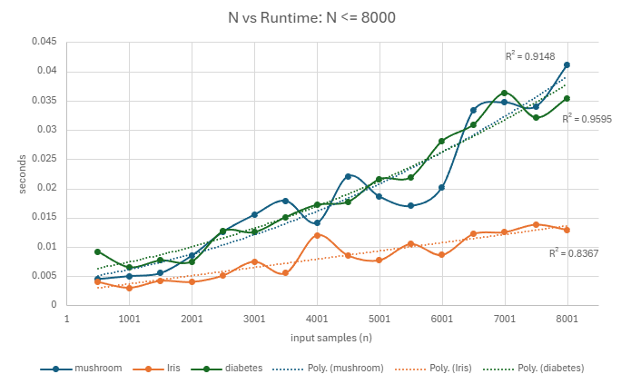
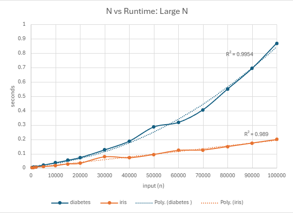

# 5008 Final Research Paper
* Name: Rowan Lowden
* Semester: Summer 2025
* Topic: Decision Tree Algorithm

## Introduction/Overview

In this report, I will explore and analyze a type of supervised learning algorithm used in machine learning for classification and regression tasks, decision trees. They are a popular algorithm that splits data into smaller subsets based on feature values making them highly useful for both classification and regression tasks due to their simplicity, interpretability, and ability to handle both categorical and numerical data.[^3] A decision tree creates a hierarchial tree structure with a root node, branches, internal nodes, and leaf nodes. The root node does not have any incoming branches, only outgoing branches that feed into the internal nodes known as decision nodes. The nodes conduct evaulations to form homogenous subsets called leaf nodes or terminal nodes.  [^1] 


Decision Trees solve the problem of classification and regression by creating a model that makes decisions based on feature values. For classification problems, they predict categorical labels, such as determining whether a mushroom is edible or poisonous based on its attributes (e.g., color, size, odor). [^3] In regression problems, Decision Trees predict continuous values, like estimating house prices based on features such as size and location [^4]. The algorithm recursively splits data at each node based on the most informative features, using criteria like Gini Impurity or Information Gain [^5]. One of the key advantages of Decision Trees is their interpretability, as the structure of the tree allows us to trace the path of decisions leading to a final prediction. This makes them a valuable tool in a wide range of real-world applications, including medical diagnosis, credit scoring, and customer segmentation [^6]. 

In this report. I will provide both theoretical and empirical analysis. First I will provide time and space complexities to understand its efficiency and scalability. Then I will proceed with an empirical analysis, where we apply the CART Decision Tree algorithm to a mushroom classification dataset, evaluating its performance and visualizing key results. The paper will also cover the application of Decision Trees in real-world contexts, such as a discussion on the algorithms use in modern scienfitic research demonstrating the practical value across various fields. Lastly, I will detail the implementation process, highlighting the challenges faced during this learning process and discussing the decisions made throughout. The conclusion will summarize key findings and suggest potential improvements or future research directions.


### Algorithm Development 

Decision Trees have a rich history in the field of machine learning, with their roots tracing back to the 1960s.Hunt's Algorithm, developed in the 1960s, was one of the earliest methods for modeling human learning in psychology, particularly in terms of inductive learning. It was designed to replicate how humans make decisions based on prior experiences. The algorithm was first introduced by J. Hunt and colleagues as part of a broader study into cognitive processes and the way humans organize knowledge. Hunt’s work laid the groundwork for many modern decision tree algorithms used in machine learning today. [^7] Then in the 1980's, the earliest form of Decision Trees was introduced by Ross Quinlan with the ID3 algorithm in 1986. It used information gain to split the data at each node, making it one of the first algorithms to use recursive binary splitting for classification [^3]. Quinlan's work then evolved into the C4.5 algorithm, introduced in 1993, which improved upon ID3 by incorporating pruning to avoid overfitting, handling both continuous and discrete attributes, and using the gain ratio for more accurate splits [^5]. In the 1980s, the CART (Classification and Regression Trees) algorithm was developed by Breiman et al., which introduced the use of Gini Impurity for classification and Mean Squared Error (MSE) for regression, becoming one of the most widely used Decision Tree algorithms today [^4]. Over time, Decision Trees have become a cornerstone of machine learning, leading to the development of ensemble methods like Random Forests and Gradient Boosting, which combine multiple trees to improve predictive accuracy and robustness [^6].

## Application

Decision trees have become widely used in many scientific fields beyond computer science due to their intuitive structure and ease of interpretation. They are especially valuable in high-stakes fields like healthcare, where transparency and trust in model predictions are critical [^9] [^11]. Their ability to identify key variables and present rule-based decisions makes them useful for researchers in areas such as medicine, environmental monitoring, and even energy policy [^10]. These models not only provide accurate predictions but also help researchers and decision-makers understand the "why" behind outcomes—supporting insight-driven interventions across diverse disciplines. During my research, I was pleased to find many research papers utilizing decision trees. Below I briefly describe 3 papers I found interesting and how they implmented decision trees.

The first paper by Lu & Ma published in 2020, proposed two different decsision tree models for short term water quality predicitions in the Tualitin River. They aimed to predict short‑term changes in river conditions such as temperature, dissolved oxygen, pH, conductivity, turbidity, and fluorescence. The authors first took the raw enviromental data collected hourly, cleaned it using CEEMDAN, and then trained decision tree based models (Random Forest and Gradient Boosting) to make forecasts on water quality in the near future. Lastly they compared them to conventional baselines or previously collected data to compare the outcomes of the new models. In this research, decision trees were central because they cope well with irregular, multiscale patterns in environmental data, offer robust performance without heavy feature engineering, and provide variable importance to guide monitoring and operations. In practice, the hybrid “CEEMDAN + tree model” design yielded accurate, stable predictions across indicators—useful for proactive management (e.g., anticipating low oxygen events or turbidity spikes) when timely, trustworthy forecasts matter. [^14]

The second research paper I examined, from 2022, is in response to the urgent need for ICU triage tools during the COVID-19 pandemic, Elhazmi et al. conducted a multicenter study across 14 hospitals in Saudi Arabia from March 2020- Oct 2020 to predict 28-day mortality in critically ill COVID-19 patients using decision trees. The researchers trained a C4.5 decision tree model on clinical data from 1,468 patients, incorporating variables such as intubation status, vasopressor use, oxygenation (PaO₂/FiO₂), age, and gender. The decision tree was chosen for its interpretability and bedside usability, offering a transparent, rule-based structure that clinicians could use to quickly assess risk. The final model demonstrated good accuracy (73.1%) with intubation as the root decision node followed by key clinical indicators [^12]. Compared to traditional logistic regression, the tree provided immediate visual reasoning and actionable insights, highlighting the decision tree’s importance as a practical and interpretable tool in real-time critical care settings.

The third research study examined to demonstrate the real world application of the decision tree algorithm was Hajihosseinlou, Asghari, and Shirvani research from 2023. They applied decision tree–based machine learning to support mineral exploration by modeling the likelihood of Mississippi Valley-type (MVT) lead–zinc deposits in Iran’s Varcheh district. The researchers used Light Gradient Boosting Machine (LightGBM), a highly efficient ensemble of decision trees optimized for speed and accuracy, to analyze a wide range of geoscientific data, including geological structures, geochemical indicators, and remote sensing imagery. LightGBM was selected for its ability to handle large, high-dimensional datasets while capturing complex, nonlinear relationships among predictive features. Compared to other models like XGBoost, LightGBM achieved higher precision and recall, identifying 92% of known mineral occurrences within just 10% of the mapped area. The decision tree–based approach was crucial for reducing exploration costs by pinpointing high-prospect zones, making it an invaluable tool for guiding field investigations and drilling programs in economic geology [^13].  

Decision trees are powerful, versatile tools used across many scientific fields because they combine strong predictive performance with clear, interpretable logic. From ICU triage during the COVID-19 pandemic to forecasting river water quality and guiding mineral exploration, decision trees help researchers make sense of complex data and support real-world decisions. Their ability to handle diverse data types, reveal important variables, and produce transparent, rule-based models makes them especially useful in high-stakes fields like healthcare, environmental science, and resource management. As these examples show, decision trees are not just algorithms—they’re practical frameworks for turning data into actionable insight.


## Theoretical Analysis

### Entropy, Information Gain, and Gini Impurity ?? 
how the algo makes decisions (which splits to choose) splitting criteria

In order to understand machine learning algorithm growth over time, such as the decision tree algorithm, it's important to understand how the algorithm is making decisions to split a dataset. The decision tree CART algorithm's goal is to split a dataset so it's classified correctly, using the features as information for splitting. In order to split, under the hood, the algoritm calculated entropy, information gain, and gini impurity to make those decisions. 

I will start with entropy, since it is a concept that is vital to explain imformation gain and gini impurity. Entropy is a measurement of disorder and is fundemental in many fields including thermodynamics and infomation theory. It is calculated with the following formula:

$$
\text{Entropy}(S) = - \sum_{c \in C} p(c) \log_2 p(c)
$$

* $S$ is the dataset of labeled samples that entropy is calculated.
* $c$ is the classes in the set $S$. 
* $p(c)$ represents the proportion of data points that belong to class $c$ to the number of total data points in the set. 

Calcuated entropy values fall between 0 and 1 with low entropy or disorder in a set equaling 0 and if a set has samples of half one class and half another the entropy will be the highest at 1. In order to find the optimal split, the decision tree algorithm will find the best feature to split the dataset with the smallest amount of entropy. 

Information gain is a measurement of how well organized a dataset is after a split. It represents the difference in entropy before and after a spit on given feature. IF an attribute has high information gain it will produce the best split which means it is excelling at classifying the training data according to the targe classification. It is represented by the following fomula: 

$$
\text{Information Gain}(S, a) = \text{Entropy}(S) - \sum_{v \in \text{Values}(a)} \frac{|S_v|}{|S|} \cdot \text{Entropy}(S_v)
$$

* $a$ represents a specific attribute 
* Entropy$(S)$ is the entropy dataset
* $\frac{|S_v|}{|S|}$ is the proportion of the subset with a specific attrbution to the entire dataset.

Fore example, if we consider a theoretical instance with 100 mushroom samples and 60 are edible while 40 are poisonous. We already know entropy would be high with distinct almost half and half split between classifications, but for claririty, the entropy would be caculated: 


$$
\text{Entropy}(S) = -\left(\frac{60}{100}\right) \log_2 \left(\frac{60}{100}\right) - \left(\frac{40}{100}\right) \log_2 \left(\frac{40}{100}\right)
$$

$$
\text{Entropy}(S) = -0.6 \log_2(0.6) - 0.4 \log_2(0.4) = 0.970
$$

Now if the algorithm splitted the data on the feature/attricute odor. If 30 mushrooms have a foul odor and all of them are poisonious (entropy = 0) and the remaining 70 have mixed classification (60 edible and 10 poisonous), the entropy would be calcauted as followed

$$
\text{Entropy}(S_{\text{odor} \neq \text{foul}}) = -\left(\frac{60}{70}\right) \log_2 \left(\frac{60}{70}\right) - \left(\frac{10}{70}\right) \log_2 \left(\frac{10}{70}\right)
$$

$$
\text{Entropy} = -0.857 \log_2(0.857) - 0.143 \log_2(0.143) \approx 0.863
$$

With an the entropy caculations of 0 and 0.863. The calculated information gain from splitting on the odor feature would be:

$$
\text{Gain}(S, \text{odor}) = \text{Entropy}(S) - \left( \frac{30}{100} \cdot 0 \right) - \left( \frac{70}{100} \cdot 0.863 \right)
$$

$$
\text{Gain}(S, \text{odor}) = 0.970 - 0 - 0.604 = 0.366
$$

This means that splitting by odor is a significant reduction in entropy and reduces the impurity, therefore the decision tree algorithm would likely select this as the first feature to split on. 

Lastly, before discussing Big


### stopping criteria (max depth, min samples, pure node)

overfitting, pruning, and regularization 

### Time and Complexity: Big O how the algo runs as the input grows


Understanding the time and space complexity of Decision Tree algorithms is crucial for evaluating their efficiency, particularly as the dataset size increases. The time complexity of Decision Trees is influenced by the number of samples and features in the dataset, with the algorithm needing to evaluate all features for each potential split at each node. They use divide and conquer strategy by conducting a greedy search to identify the optimal splits within the tree data. The splitting continues to repeat in a top down recursive manner until all the data has been labeled under specific labels. [^1] 

In the below pseudocode, The outer `while` loop runs recursively, with the depth of the tree increasing as the number of splits grows. At each level, the algorithm evaluates potential splits for each node. The inner `for` loop iterates over all nodes at the current depth, performing a split if the node is valid `(Node(i) > -1)`. For each node, the algorithm evaluates all `m` features to find the best split, typically involving sorting or scanning the data. Since the tree depth is logarithmic in relation to the number of samples, the overall time complexity is $O(n * m * log n)$ where `n` is the number of samples, `m` is the number of features, and $logn$ corresponds to the tree’s maximum depth [^4]. Therefore, the time complexity for building a decision tree is $O(n * m * log n)$, where $n$ is the number of data samples and $m$ is the number of features. This is because of greedy search for the best feature to split the data, involving sorting or scanning through the dataset. The recursive tree-building process continues until the tree is fully grown, which can be computationally expensive for large datasets [^4].

The space complexity of Decision Trees is typically $O(n)$, as the tree structure needs to store both the data at each node and the tree itself. Each node in the tree may contain information about the data split and the distribution of the labels. Additionally, the tree's depth affects both time and space complexity, with deeper trees requiring more memory to store additional nodes. Overfitting, a common issue with decision trees, can also lead to higher space complexity due to the tree's depth increasing unnecessarily [^3].  

### Pseudocode: CART Algorithm 

Understanding the time complexity of the Decision Tree algorithm involves examining how the algorithm builds the tree and evaluates splits at each node. The outer while loop runs for O(log n) iterations, as the depth of the tree grows logarithmically with respect to the number of samples. The inner for loop processes all nodes at each depth level, with the number of nodes doubling at each level (approximately 2^d nodes at depth d). For each node, the algorithm evaluates m features to find the best split, and this evaluation typically involves sorting or scanning through the dataset, which has a time complexity of O(n log n) per feature. Thus, the overall time complexity is O(n * m * log n), where n is the number of samples, m is the number of features, and log n represents the tree depth.

In terms of space complexity, the Decision Tree algorithm requires space to store both the dataset and the tree structure. Each node in the tree stores information about the feature used for splitting, the split value, and possibly the dataset passing through the node. In the worst case, a fully grown tree with n samples has up to 2n - 1 nodes, which results in a space complexity of O(n). This space is primarily consumed by the dataset and the tree structure, which grows linearly with the number of samples (n). Thus, the overall space complexity of Decision Trees is O(n).

Below is the pseudocode for the Decision Tree CART Algorithm [^8]:

```d = 0, endtree = 0

Note(0) = 1, Node(1) = 0, Node(2) = 0

while endtree < 1
    if Node(2d-1) + Node(2d) + .... + Node(2d+1-2) = 2 - 2d+1   
        endtree = 1

    else
        do i = 2d-1, 2d, .... , 2d+1-2
            if Node(i) > -1
                Split tree

            else 
                Node(2i+1) = -1
                Node(2i+2) = -1

            end if

        end do

    end if

d = d + 1

end while
```


## Implementation
- What language did you use?
- What libraries did you use?
- What were the challenges you faced?
- Provide key points of the algorithm/datastructure implementation, discuss the code.
 
For this project, I implemented and evaluated a Decision Tree algorithm using Python due to its readability and extensive machine learning libraries. I used the pandas and numpy libraries for data cleaning and manipulation, and scikit-learn for model building, training, and evaluation. The dataset I worked with was the Mushroom dataset from Kaggle.com, which contains roughly 8,000 entries representing different types of mushrooms, each labeled as either edible or poisonous based on 22 categorical features.

I used scikit-learn’s `DecisionTreeClassifier` to build and train the model. First, I loaded the dataset with pandas, encoded categorical values using built-in functions, and split the data into training and testing sets using train_test_split. I then trained the classifier and evaluated its performance using accuracy_score and classification_report to measure precision, recall, and F1-score. These tools allowed me to quickly understand the model's performance and adjust parameters when necessary. The decision tree algorithm provided an interpretable model that could accurately classify mushrooms with high reliability.

One of the main challenges I faced was understanding the structure of machine learning workflows for the first time—especially how to prepare data for training and interpret classification metrics. Learning how to use scikit-learn was particularly helpful, as it provided many built-in functions for splitting datasets, fitting models, and generating performance reports. This project helped me better understand how decision trees are implemented and trained in real-world applications and gave me practical experience applying machine learning techniques to solve mushroom classification problems.

```python
def split_data(X, y, test_size=0.2):
    return train_test_split(X, y, test_size=test_size, random_state=42)

```
This function splits the feature set (X) and labels (y) into training and testing subsets. It uses an 80/20 split by default and sets a fixed random_state to ensure reproducible results.

```python

def train_decision_tree(X_train, y_train):
    clf = DecisionTreeClassifier(random_state=42)
    clf.fit(X_train, y_train)
    return clf 
```

This function creates and trains a scikit-learn `DecisionTreeClassifier` on the training data. The random_state is set for reproducibility. The .fit() method builds the tree by recursively splitting the dataset based on feature values to reduce Gini impurity.

After training the model using `DecisionTreeClassifier`, I visualized a simplified tree by setting a `max_depth` of 5 and classified the mushroom dataset. A depth of 5,  makes the tree small enough to interpret while still showing how the model selects features and splits based on them. Each node displays the splitting condition, number of samples, Gini impurity, and the predicted class. 


This visual shows how the decision tree identifies patterns in the data. For example, in the mushroom dataset, the model may split first on odor, which has high predictive value, followed by stalk, qualties of the cap, or other important features. The darker the color the more confident the model is in the predicition while the lighter color has more mized samples (edible and poisinous) and a higher Gini impurity. The blue node predicts poisonous while the orange predicts edible mushrooms. 

```python 
def evaluate_model(model, X_test, y_test):
    y_pred = model.predict(X_test)
    accuracy = accuracy_score(y_test, y_pred)
    print(f"Accuracy: {accuracy}")
    print("Classification Report:")
    print(classification_report(y_test, y_pred))
    return accuracy
```
This function uses the trained model to predict labels on the test set, then evaluates its performance using accuracy_score and classification_report. It prints and returns the overall accuracy, and displays precision, recall, and F1-score for each class.

```python

def time_model_training(X, y, sample_sizes):
    results = []

    for size in sample_sizes: #loop through the sample sizes
        #sample of the data
        X_sample = X[:size]
        y_sample = y[:size]

        #split into the train and test sets
        X_train, X_test, y_train, y_test = train_test_split(X_sample, y_sample, test_size=0.2, random_state=42)
        
        #train and time the model
        start = time.time()
        model = train_decision_tree(X_train, y_train)
        end = time.time()
        
        #evalulate the model with accuracy score
        accuracy = evaluate_model(model, X_test, y_test)

        #timing 
        duration = end - start
        #save results
        results.append((size, accuracy, duration))

    return results
```
This function evaluates how the model’s training time and accuracy change as the dataset grows. For each sample size, it splits the data, trains the model, records how long training takes, evaluates accuracy, and stores the results for empirical analysis.

## Empirical Analysis

To evaluate the performance of the Decision Tree classification algorithm, I conducted experiments using three datasets from the kaggle website: first a Mushroom dataset (~8,000 samples, 23 features) [^17], a Iris dataset (100,000 samples, 4 features) [^15], and a clinical diabetes dataset (100,000, 16 features) [^16]. The classification tasks involved predicting whether a mushroom is edible or poisonous, identifying an iris species, and determining whether an individual has diabetes. This section provides empirical evidence of runtime behavior across varying sample sizes, highlights scalability trends, and supports the algorithm's theoretical $O(n·log(n))$ time complexity. I also report classification accuracy using Python’s built-in `accuracy_score` function to assess model effectiveness.

All data used to make the following graphs is in the attached excel workbook. 

[Final Research Paper Workbook](results/5008%20final%20project%20graphs(Sheet1).csv)

### Input(n) vs Runtime

To evaluate the time complexity of the Decision Tree algorithm, I measured training time as the number of input samples increased across three datasets. The first graph focuses on smaller sample sizes (n ≤ 8000), highlighting early runtime behavior and variability between datasets. The second graph extends this analysis to larger datasets (up to 100,000 samples) using the Iris and Diabetes data to examine scalability and validate the expected quasi-linear growth pattern of O(n·log n). Polynomial trendlines were fitted to both graphs to help visualize runtime trends and assess consistency with theoretical expectations.

#### N <= 8000




This graph shows the runtime of the Decision Tree classifier on all three datasets with input sizes up to 8,000 samples. While individual runtime values varied slightly — likely due to background processes and hardware factors — the overall growth trend for each dataset is captured well by polynomial trendlines. The high R² values, particularly for the mushroom (0.9148) and diabetes (0.9595) datasets, support a runtime pattern consistent with O(n log n) complexity. These results reflect the expected behavior of Decision Tree training as data volume increases, even in smaller-scale experiments. This variation in runtime at smaller scales is one reason I decided to test larger datasets, such as the iris and diabetes datasets, to more clearly observe and compare runtime trends alongside the mushroom dataset.

#### N <= 100,000

\

This graph displays the runtime of the Decision Tree classifier on the larger iris and diabetes datasets, with sample sizes ranging from 1,000 to 100,000. Both curves follow a smooth upward trajectory, and the polynomial trendlines fit the data closely, with R² values of 0.989 for iris and 0.9954 for diabetes. These near-perfect fits support the expected $O(n log n)$ time complexity of Decision Tree training. The clarity and consistency of these results at larger scales confirm the theoretical growth behavior more reliably than the smaller-scale tests.


### Decision Tree Accuracy

In this analysis, I used the `accuracy_score` function from the scikit-learn library to evaluate the performance of the Decision Tree classifier. This function calculates the ratio of correct predictions to the total number of predictions made, basically it measures how often the classifier was right. The score ranges from 0 to 1.0, where 1.0 represents perfect accuracy, values above 0.90 are considered great, 0.80–0.89 good, and anything below 0.70 often indicates poor performance. Several factors can influence a decision tree’s accuracy, including the quality and relevance of features, the balance of class labels, the size of the dataset, and tree depth. Since the datasets used in this project are relatively balanced and vary in size and feature count, accuracy served as a reliable and interpretable metric for comparing model performance across sample sizes. [^18]

#### N <= 8000


This graph shows how accuracy varies with input size up to 8,000 samples for all three datasets. The mushroom dataset achieves near-perfect accuracy across all sample sizes, indicating that the features are highly informative and easily separable by the Decision Tree algorithm. The diabetes dataset shows high but slightly variable accuracy, stabilizing around 94–96%, while the iris dataset fluctuates more and maintains a lower accuracy around 89–92%. These results suggest that decision trees perform best on clean, well-structured data with many features and benefit from more samples when handling noisier or less separable data like the iris dataset.

#### N <= 100,000


This graph displays classification accuracy as input size increases up to 100,000 samples for the diabetes and iris datasets. Accuracy for both models stabilizes at larger sample sizes, with the diabetes classifier maintaining strong performance around 94–95%, and the iris classifier settling near 91%. The initial volatility smooths out as the model sees more data, indicating better generalization and reduced sensitivity to training variation. These results support the idea that Decision Trees benefit from larger datasets, particularly when working with more complex or less separable features like those in the iris dataset.


### Discussion
- Discuss your findings

## Summary
- Reflection / challenges
- What did you learn?

## References 
[^1]: IBM. 2023. What is a Decision Tree? IBM. https://www.ibm.com/think/topics/decision-trees (accessed July 25, 2025).  

[^2]: GeeksforGeeks. Supervised Machine Learning. GeeksforGeeks. Retrieved from https://www.geeksforgeeks.org/machine-learning/supervised-machine-learning/

[^3]: Quinlan, J.R. 1986. Induction of decision trees. Machine Learning, 1(1), 81-106. Springer. DOI: 10.1007/BF00116251.

[^4]: Breiman, L., Friedman, J.H., Olshen, R.A., and Stone, C.J. 1986. Classification and regression trees. Wadsworth & Brooks/Cole. ISBN 0-534-98099-8.

[^5]: Quinlan, J.R. 1993. C4.5: Programs for machine learning. Morgan Kaufmann Publishers. ISBN: 1-55860-238-0.

[^6]: Breiman, L. 2001. Random forests. Machine Learning, 45(1), 5-32. DOI: 10.1023/A:1010933404324.

[^7]: Hunt, E.B., Marin, J., & Stone, P.J. 1966. Experiments in Inductive Inference. Psychological Review, 73(3), 131-161. https://sso.apa.org/apasso/idm/login?CheckAccess=1&UID=1966-12300-001&ERIGHTS_TARGET=https%3A%2F%2Fpsycnet.apa.org%2FdoiLanding%3Fdoi%3D10.1037%252Fh0023706

[^8]: GeeksforGeeks. 2023. CART (Classification and Regression Tree) in Machine Learning. GeeksforGeeks. https://www.geeksforgeeks.org/machine-learning/cart-classification-and-regression-tree-in-machine-learning/ (accessed Aug. 4, 2025).

[^9]: Meshram, S. and Naik, D. 2023. Review on Decision Tree Algorithm in Healthcare Applications. International Journal of Advanced Research in Computer and Communication Engineering. https://www.researchgate.net/publication/382748363

[^10]: Alirezaei, M., Asadi, M., and Azizi, M. 2022. Decision Tree Applications in Energy Policy and Planning: A Review. Energies 15, 7 (2022), 2420. DOI: 10.3390/en15072420.

[^11]: Sharma, S. and Singh, A. 2024. Interpretable Machine Learning Techniques: A Systematic Review with a Focus on Decision Trees. Applied Sciences 14, 19 (2024), 8884. DOI: 10.3390/app14198884

[^12]: A. Elhazmi, M. Alshehri, A. Almutairi, A. Alsalemi, G. Almekhlafi, A. Alamri, A. Alharthi, M. Alfayez, et al. 2022. Predicting mortality in critically ill COVID-19 patients using decision tree models: Multicenter cohort study. Journal of Infection and Public Health 15, 6 (2022), 654–661. DOI: https://doi.org/10.1016/j.jiph.2022.03.003

[^13]: S. Hajihosseinlou, O. Asghari, and H. Shirvani. 2023. Application of Light Gradient Boosting Machine (LightGBM) in prospectivity modeling of Mississippi Valley-type Pb–Zn deposits in the Varcheh district, Iran. Natural Resources Research 32, 1 (2023), 487–506. DOI: https://doi.org/10.1007/s11053-022-10007-7

[^14]: H. Lu and X. Ma. 2020. Hybrid decision tree-based models for short-term water quality prediction. Chemosphere 248 (2020), 125988. DOI: https://doi.org/10.1016/j.chemosphere.2020.125988

[^15]: Ifeanyi Idiaye. 2024. Scaled Iris Dataset – 100k Rows. Kaggle. Retrieved August 6, 2025 from https://www.kaggle.com/datasets/idiaye/scaled-iris-dataset-100k-rows

[^16]: Priyam Choksi. 2024. Comprehensive Diabetes Clinical Dataset (100 k rows). Kaggle. Retrieved August 6, 2025 from https://www.kaggle.com/datasets/priyamchoksi/100000-diabetes-clinical-dataset

[^17]: UCI Machine Learning Repository (UCIML). 2025. *Mushroom Classification Dataset*. Kaggle. Retrieved August 6, 2025 from https://www.kaggle.com/datasets/uciml/mushroom-classification

[^18]: GeeksforGeeks. 2022. Scikit-learn: Classification Metrics. GeeksforGeeks. Retrieved August 6, 2025 from https://www.geeksforgeeks.org/machine-learning/sklearn-classification-metrics/