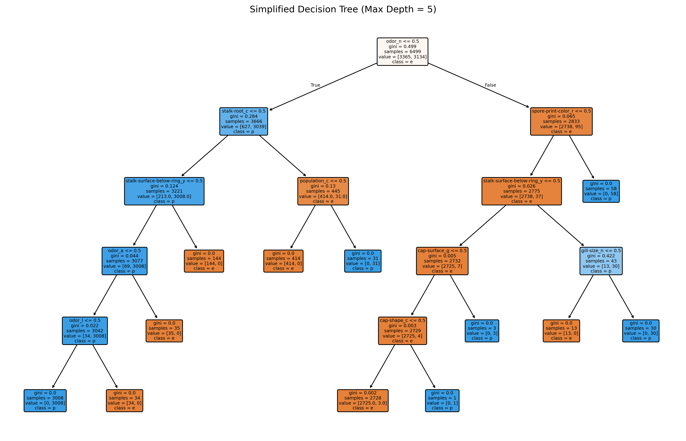

# 5008 Final Research Paper
* Name: Rowan Lowden
* Semester: Summer 2025
* Topic: Decision Tree Algorithm

## Introduction/Overview

In this report, I examine decision tree algorithms, a broad class of supervised learning methods used in machine learning. Decision trees represent models as hierarchical structures, where data is recursively partitioned into smaller subsets based on measures of split quality. They are widely applied to both classification and regression tasks due to their simplicity, interpretability, and ability to handle both categorical and numerical data[^3]. A decision tree consists of a root node, branches, internal decision nodes, and leaf (terminal) nodes. The root node has no incoming branches, only outgoing branches leading to decision nodes that apply specific conditions to split the data into increasingly homogeneous subsets until a terminal node is reached[^1].


Classification and Regression Trees (CART) are a specific implementation of decision tree algorithms designed for both classification and regression problems. In classification, CART predicts categorical outcomes, for example, determining whether a mushroom is edible or poisonous based on attributes such as color, size, and odor[^3]. In regression, it predicts continuous values, such as estimating house prices from features like square footage and location[^4]. The algorithm recursively selects the most informative feature at each node using a predefined criterion (Gini impurity for classification, variance reduction for regression) to optimize split quality[^5]. One of CART’s key advantages is its interpretability; its explicit, rule-based structure makes it possible to trace each decision path, making it especially valuable in applications ranging from medical diagnosis to economic forecasting and weather prediction, etc [^6].

This report provides a focused analysis of decision tree algorithms, covering their historical development, theoretical foundations, practical implementations, and empirical performance. It begins with a brief history and survey of real-world applications, followed by an explanation of data-splitting criteria and an analysis of computational complexity using CART pseudocode. The implementation section compares two approaches: a scikit-learn `DecisionTreeClassifier` and a custom CART algorithm applied to three datasets. An empirical analysis evaluates model accuracy and scalability across varying dataset sizes and feature counts. The report concludes with a sumamry including key and implementation challenges.

### Algorithm Development 
Decision Trees have a rich history in machine learning, with origins dating back to the 1960s. One of the earliest methods, Hunt’s Algorithm, was developed to model human inductive learning, replicating how people make decisions based on prior experiences. Introduced by J. Hunt and colleagues, this work laid the foundation for modern decision tree methods. [^7]

In 1986, Ross Quinlan introduced the ID3 algorithm, which used information gain to split data at each node, pioneering recursive binary splitting for classification. [^3] Quinlan later improved this approach with the C4.5 algorithm in 1993, adding pruning to reduce overfitting, handling both continuous and discrete attributes, and using gain ratio for more accurate splits.[^5] Around the same time, Breiman et al. developed the CART (Classification and Regression Trees) algorithm, which employed Gini Impurity for classification and Mean Squared Error for regression. [^4]

Today, Decision Trees remain a cornerstone of machine learning and have inspired powerful ensemble methods such as Random Forests and Gradient Boosting, which combine multiple trees to enhance predictive accuracy and robustness. [^6].

## Application

Decision trees are widely used across scientific fields beyond computer science due to their ability to identify key predictive variables. They are especially valuable in high-stakes domains such as healthcare, environmental monitoring, and resource management, where transparency and trust in model outputs are critical [^9] [^10] [^11]. By producing rule-based decisions and highlighting the most influential features, decision trees not only deliver accurate predictions but also explain the reasoning behind them which enable insight driven interventions. Below I summarize 3 recent research studies I found interesting that utlized decision tree models. 

The first study, by Lu & Ma (2020), developed two decision-tree-based models for short-term water quality predictions in Oregon’s Tualatin River. Using hourly environmental data such as temperature, dissolved oxygen, pH, conductivity, turbidity, fluorescence, they applied CEEMDAN for data cleaning before training Random Forest and Gradient Boosting models. Compared with conventional baselines, their hybrid decision tree model achieved stable, accurate forecasts, enabling proactive management actions such as anticipating low-oxygen events or turbidity spikes [^14].

The second study, by Elhazmi et al. (2022), addressed the urgent need for ICU triage tools during the COVID-19 pandemic. Conducted across 14 hospitals in Saudi Arabia, the study trained a C4.5 decision tree on clinical data from 1,468 critically ill patients to predict 28-day mortality. The model incorporated variables such as intubation status, vasopressor use, oxygenation ratio, age, and gender, achieving 73.1% accuracy. Its transparent, rule-based structure allowed clinicians to quickly assess patient risk at the bedside, offering clear interpretability compared to traditional logistic regression [^12].

The third study, by Hajihosseinlou, Asghari, and Shirvani (2023), applied Light Gradient Boosting Machine (LightGBM) to mineral exploration in Iran’s Varcheh district. Analyzing geological, geochemical, and remote sensing data, the model achieved 92% precision in identifying known mineral deposits within 10% of the mapped area. The decision-tree-based approach significantly reduced exploration costs by focusing efforts on high-prospect zones, demonstrating its value in economic geology [^13].

From forecasting river conditions to ICU triage and mineral exploration, decision trees demonstrate versatility, strong predictive power, and clear interpretability. Their capacity to handle diverse data types, model complex relationships, and provide actionable rules makes them an indispensable tool for both scientific research and real-world decision-making.

## Theoretical Analysis

### Splitting Data: Entropy, Information Gain, and Gini Impurity

To understand the performance of decision tree algorithms such as CART, it is important to examine how they determine the best feature to split the dataset at each step. The goal of any decision tree is to create splits that produce increasingly homogeneous subsets, improving classification or regression accuracy. Different decision tree algorithms use different measures to guide these splits. ID3 and C4.5 use entropy and information gain, while CART, the focus of this project, uses Gini Impurity for classification.

Entropy measures the amount of disorder in a dataset and is fundamental to information theory. It is calculated as:

$$
\text{Entropy}(S) = - \sum_{c \in C} p(c) \log_2 p(c)
$$

* $S$ is the dataset
* $c$ is the classes in the set $S$. 
* $p(c)$ represents the proportion of data points that belong to class $c$ 

Calcuated entropy values fall between 0 and 1 with low entropy or disorder in a set equaling 0 and if a set has samples of half one class and half another the entropy will be the highest at 1. In order to find the optimal split, the decision tree algorithm will find the best feature to split the dataset with the smallest amount of entropy. 

Information gain measures the reduction in entropy after a dataset is split on a feature. If an attribute has high information gain it will produce the best split which means it is excelling at classifying the training data according to the target classification. It is represented by the following formula: 

$$
\text{Information Gain}(S, a) = \text{Entropy}(S) - \sum_{v \in \text{Values}(a)} \frac{|S_v|}{|S|} \cdot \text{Entropy}(S_v)
$$

* $a$ represents attribute being split
* Entropy$(S)$ is the entropy dataset
* $\frac{|S_v|}{|S|}$ is the proportion of the subset with a specific attrbution to the entire dataset.

For example, if we consider a dataset with 100 mushroom samples and 60 are edible while 40 are poisonous, the entropy is: 

$$
\text{Entropy}(S) = -0.6 \log_2(0.6) - 0.4 \log_2(0.4) = 0.970
$$

If the algorithm splits the data on odor. If 30 mushrooms have a foul odor and all of them are poisonious (entropy = 0) and the remaining 70 have mixed classification (60 edible and 10 poisonous), the entropy would be calcauted as followed

$$
\text{Entropy}(S_{\text{odor} \neq \text{foul}}) = -\left(\frac{60}{70}\right) \log_2 \left(\frac{60}{70}\right) - \left(\frac{10}{70}\right) \log_2 \left(\frac{10}{70}\right)
$$

$$
\text{Entropy} = -0.857 \log_2(0.857) - 0.143 \log_2(0.143) \approx 0.863
$$

With an the entropy caculations of 0 and 0.863. The calculated information gain from splitting on the odor feature would be:

$$
\text{Gain}(S, \text{odor}) = \text{Entropy}(S) - \left( \frac{30}{100} \cdot 0 \right) - \left( \frac{70}{100} \cdot 0.863 \right)
$$

$$
\text{Gain}(S, \text{odor}) = 0.970 - 0 - 0.604 = 0.366
$$

This means that splitting by odor is a significant reduction in entropy and reduces the impurity, therefore the decision tree algorithm would likely select this as the first feature to split on. 

Gini impurity, used by CART, is a probability calculation signifiying if a random data point is incorrectly classificed in a dataset. Similar to entropy, if a set $S$ is pure and all one class (edible) then the gini impurity would be 0. Unlike entropy, the gini impurity maximum depends on the number of classes. If there are 2 classes, like the mushroom example, the maximum gini impurity is 0.5. The formula for gini imputiy is as follows:

$$
\text{Gini}(S) = 1 - \sum_{c \in C} \left(p(c)\right)^2
$$

* $C$ is the set of classes
* $p(c)$ is the probability of a datapoint bellonging to class $C$. 
* $\sum_{c \in C}$ the sum of $c$ within $C$

Entropy and Gini Impurity are both measures of impurity used by decision tree algorithms to decide where to split the data. Entropy is based on information theory and involves logarithmic calculations, while Gini Impurity is simpler and faster to compute, measuring the probability of misclassification. The `DecisionTreeClassifier` in scikit-learn defaults to using Gini Impurity because it is computationally efficient and typically results in similar split decisions as entropy.

Understanding how decision trees choose splits using entropy, information gain, and Gini impurity provides valuable insight into the logic behind the algorithm. These measures ensure the model reduces impurity at each step, gradually organizing the dataset into more homogenous subsets. By visualizing and calculating these values in examples like the mushroom dataset, we gain a clearer picture of how the algorithm operates under the hood. This foundation helps contextualize later analysis of runtime complexity, scalability, and model performance across different dataset.


### Time and Complexity: Big O

Understanding the time and space complexity of the CART Decision Tree algorithm is essential for evaluating its scalability and performance. CART builds decision trees using a recursive, top-down, divide-and-conquer approach, classifying input data based on feature values. At each internal node, the algorithm uses a greedy search to find the feature and threshold that yield the greatest reduction in impurity, measured with Gini Impurity as described earlier. [^1] 

The training time of a decision tree depends on the number of samples $n$, the number of features $m$, and the depth of the tree. The table below summarizes the theoretical time and space complexities for the best, average, and worst cases considered in this report. A detailed explanation and pseudocode follow.

| Case |  Time Complexity | Space Used | 
| :-- | :-- |  :-- |
| Best | $O(n \cdot m \cdot \log n)$ | $O(n)$ |
| Average | $O(n \cdot m \cdot \log n)$ | $O(n)$ |
| Worst | $O(n^2 \cdot m)$ | $O(n)$ |


### Pseudocode: CART Algorithm 

To better understand where the logarithmic depth and nested evaluations come from, consider the following simplified pseudocode for growing a binary decision tree using the CART algorithm: [^8]:

```
Initialize active_nodes = { root containing all samples }
depth = 0

while active_nodes is not empty:
    next_active_nodes = {}

    for each node in active_nodes:
        if stopping_condition(node):
            make_leaf(node)
        else
            (best_feature, threshold) = find_best_split(node.data) //gini impurity
            (left_data, right_data) = split(node.data, best_feature, threshold)
            create left_child, right_child
            assign data
            add left_child and right_child to next_active_nodes

    active_nodes = next_active_nodes
    depth = depth + 1
end while

```
The recursion depth of the tree corresponds to the number of iterations of the outer `while` loop not being empty and depends on how balanced the splits are. In the best and average cases, the dataset is split evenly at each step, leading to a balanced binary tree with a depth proportional to $logn$ In the worst case, where splits are highly unbalanced and a split removes only one sample, the depth can grow to $n$. This depth is important because it determines the number of times the algorithm must descend into child nodes during training.

Within each iteration of the `while` loop, the inner `for` loop calls `find_best_split`(node.data) for each active_node at the current depth. This function evaluates all features to determine the optimal split, which may require sorting or scanning through the data at that node. If sorting is nessecary the implementation will require $O(n \log n)$ operations per feature  or $O(n)$ if only scanning is performed. Because every node at a given depth collectively processes the entire dataset, the total amount of work across all levels in a balanced tree sums to $O(n \cdot m \cdot \log n)$.[^4]

In the worst-case scenario, where the tree becomes a chain of nodes, the number of node evaluations grows quadratically, resulting in a time complexity of $O(n^2 \cdot m)$. Practical implementations, such as scikit-learn’s CART-based `DecisionTreeClassifier`, typically use stopping conditions such as maximum depth or minimum samples per split to prevent such inefficient growth. [^4]

The space complexity of a decision tree is $O(n)$ across all cases. This is because a binary tree with $n$ samples can have at most $2n - 1$ nodes, and each node stores a small, constant amount of information such as the split feature, threshold, and label distribution. While deeper trees require more internal nodes, the total memory required still scales linearly with the size of the dataset. [^3]

### Proof of Correctness: Loop of Invariant

**Loop Invariant:** At the start of each iteration of the `while` loop at depth `d`:

1. Every node in `active_nodes` contains samples that match its path of previous splits.
2. All samples appear in exactly one node, they are never duplicated or lost. 
3. For all nodes still in `active_nodes`, if it terminated right now, it would be labeled based on the current samples the node contains. 
4. A node already marked as a leaf has a final classification label which match all other samples in the node. 

**Initialization:** At `depth = 0`, before the first loop iteration, `active_nodes = {root}`, which contains all samples of the given dataset. No splits have occured, so the invariant holds. 

**Maintenance:** Assume the invariant holds at the start of each iteration.
For each node in `active_nodes`, if the stopping condition is met, a leaf node is created and a label is assigned without altering the data, so the invariant holds. 
* If the node is split, `split(node.data, best_feature, threshold` partitions the node’s samples into `left_data` and `right_data` without duplication or loss of data. Each child node inherits exactly one subset of data and replaces the parent in `active_nodes.` Their data still matches the path of splits leading to them. Existing leaves remain correct and the invariant still holds for the next iteration.

**Termination:** The loop ends when `active_nodes` is empty. By the invariant, every sample has followed a unique path from the root to exactly one leaf, and no sample is misassigned. Therefore, the algorithm correctly represents the tree's partitioning and can classify any sample consistently.

## Implementation

For this project, I used Python due to its robust ecosystem of machine learning libraries. I relied on pandas and numpy for data preprocessing, matplotlib for tree visualzation, excel for graphing, scikit-learn for implementing one version of the Decision Tree algorithm, and a second implmentation of CART algorithm from scratch. This includes training the model and evaluating performance. I worked with 3 datasets from Kaggle:

* Mushroom dataset (~8000 samples, 22 features) [^17]
* Iris dataset (100,000 samples, 4 features) [^15]
* Clinical diabetes dataset (100,000 samples, 16 features) [^16]

I began with the mushroom dataset, but due to its smaller size, I added larger datasets to better explore the algorithm's runtime and scalability as well as exploring what it means to have different number of features for classification. 

### DecsionTreeClassifer (sci-kit learn)

To build and train the model, I used scikit-learn’s built-in `DecisionTreeClassifier`, a common implementation of the CART (Classification and Regression Tree) algorithm. After researching popular workflows, I found this method was widely used in machine learning tasks. I used functions such as `train_test_split()` to split data, and `accuracy_score()` and `classification_report()` to evaluate how well the model performed on the test set. [^20] These tools allowed me to quickly understand the model's performance and adjust parameters when necessary. The decision tree algorithm provided an interpretable model that could accurately classify data with high reliability (accuracy values available in the empirical analysis). [^18]

A key challenge was learning how to structure the machine learning workflow, especially understanding how to encode categorical features, split data correctly, and interpret performance metrics. Sklearn’s built-in tools made it easier to get reliable results quickly and focus on understanding how decision trees work under the hood. This project gave me hands-on experience applying a decision tree algorithm across datasets of varying size and complexity using a professional workflow.

Below I walk through my code to show my a implmented these built in tools to learn and analyze decision tree algorithm. 

```python
def split_data(X, y, test_size=0.2):
    return train_test_split(X, y, test_size=test_size, random_state=42)

```
This function splits the feature set (X) and labels (y) into training and testing subsets. It uses an 80/20 split by default and sets a fixed random_state to ensure reproducible results.

```python

def train_decision_tree(X_train, y_train):
    clf = DecisionTreeClassifier(random_state=42)
    clf.fit(X_train, y_train)
    return clf 
```

This function creates and trains a scikit-learn `DecisionTreeClassifier` on the training data. The random_state is set for reproducibility. The .fit() method builds the tree by recursively splitting the dataset based on feature values to reduce Gini impurity.

After training the model using `DecisionTreeClassifier`, I visualized a simplified tree by setting a `max_depth` of 5 and classified the mushroom dataset. A depth of 5,  makes the tree small enough to interpret while still showing how the model selects features and splits based on them. Each node displays the splitting condition, number of samples, Gini impurity, and the predicted class. 



This visual shows how the decision tree identifies patterns in the data. For example, in the mushroom dataset, the model may split first on odor, which has high predictive value, followed by stalk, qualties of the cap, or other important features. The darker the color the more confident the model is in the predicition while the lighter color has more mized samples (edible and poisinous) and a higher Gini impurity. The blue node predicts poisonous while the orange predicts edible mushrooms. 

```python 
def evaluate_model(model, X_test, y_test):
    y_pred = model.predict(X_test)
    accuracy = accuracy_score(y_test, y_pred)
    print(f"Accuracy: {accuracy}")
    print("Classification Report:")
    print(classification_report(y_test, y_pred))
    return accuracy
```
This function uses the trained model to predict labels on the test set, then evaluates its performance using accuracy_score and classification_report. It prints and returns the overall accuracy, and displays precision, recall, and F1-score for each class.

```python

def time_model_training(X, y, sample_sizes):
    results = []

    for size in sample_sizes: #loop through the sample sizes
        #sample of the data
        X_sample = X[:size]
        y_sample = y[:size]

        #split into the train and test sets
        X_train, X_test, y_train, y_test = train_test_split(X_sample, y_sample, test_size=0.2, random_state=42)
        
        #train and time the model
        start = time.time()
        model = train_decision_tree(X_train, y_train)
        end = time.time()
        
        #evalulate the model with accuracy score
        accuracy = evaluate_model(model, X_test, y_test)

        #timing 
        duration = end - start
        #save results
        results.append((size, accuracy, duration))

    return results
```
This function evaluates how the model’s training time and accuracy change as the dataset grows. For each sample size, it splits the data, trains the model, records how long training takes, evaluates accuracy, and stores the results for empirical analysis.

### CART Algorithm

## Empirical Analysis

To evaluate the performance of the Decision Tree classification algorithm, I conducted experiments using three datasets from the kaggle website: first a Mushroom dataset (~8,000 samples, 23 features) [^17], a Iris dataset (100,000 samples, 4 features) [^15], and a clinical diabetes dataset (100,000, 16 features) [^16]. The classification tasks involved predicting whether a mushroom is edible or poisonous, identifying an iris species, and determining whether an individual has diabetes. This section provides empirical evidence of runtime behavior across varying sample sizes, highlights scalability trends, and supports the algorithm's theoretical $O(n \cdot \log(n))$ time complexity. I also report classification accuracy using Python’s built-in `accuracy_score` function to assess model effectiveness.

All data used to make the following graphs is in the attached excel workbook. 

[Final Research Paper Workbook](results/5008%20final%20project%20graphs(Sheet1).csv)

### DecsionTreeClassifer: sci-kit learn

#### Input(n) vs Runtime

To evaluate the time complexity of the Decision Tree algorithm, I measured training time as the number of input samples increased across three datasets. The first graph focuses on smaller sample sizes (n ≤ 8000), highlighting early runtime behavior and variability between datasets. The second graph extends this analysis to larger datasets (up to 100,000 samples) using the Iris and Diabetes data to examine scalability and validate the expected quasi-linear growth pattern of $O(n \cdot \logn)$. Polynomial trendlines were fitted to both graphs to help visualize runtime trends and assess consistency with theoretical expectations.


This graph shows the runtime of the Decision Tree classifier on all three datasets with input sizes up to 8,000 samples. While individual runtime values varied slightly — likely due to background processes and hardware factors — the overall growth trend for each dataset is captured well by polynomial trendlines. The high R² values, particularly for the mushroom (0.9148) and diabetes (0.9595) datasets, support a runtime pattern consistent with O(n log n) complexity. These results reflect the expected behavior of Decision Tree training as data volume increases, even in smaller-scale experiments. This variation in runtime at smaller scales is one reason I decided to test larger datasets, such as the iris and diabetes datasets, to more clearly observe and compare runtime trends alongside the mushroom dataset.


\

This graph displays the runtime of the Decision Tree classifier on the larger iris and diabetes datasets, with sample sizes ranging from 1,000 to 100,000. Both curves follow a smooth upward trajectory, and the polynomial trendlines fit the data closely, with R² values of 0.989 for iris and 0.9954 for diabetes. These near-perfect fits support the expected $O(n log n)$ time complexity of Decision Tree training. The clarity and consistency of these results at larger scales confirm the theoretical growth behavior more reliably than the smaller-scale tests.


#### Decision Tree Accuracy

In this analysis, I used the `accuracy_score` function from the scikit-learn library to evaluate the performance of the Decision Tree classifier. This function calculates the ratio of correct predictions to the total number of predictions made, basically it measures how often the classifier was right. The score ranges from 0 to 1.0, where 1.0 represents perfect accuracy, values above 0.90 are considered great, 0.80–0.89 good, and anything below 0.70 often indicates poor performance. Several factors can influence a decision tree’s accuracy, including the quality and relevance of features, the balance of class labels, the size of the dataset, and tree depth. Since the datasets used in this project are relatively balanced and vary in size and feature count, accuracy served as a reliable and interpretable metric for comparing model performance across sample sizes. [^18]

#### N <= 8000


This graph shows how accuracy varies with input size up to 8,000 samples for all three datasets. The mushroom dataset achieves near-perfect accuracy across all sample sizes, indicating that the features are highly informative and easily separable by the Decision Tree algorithm. The diabetes dataset shows high but slightly variable accuracy, stabilizing around 94–96%, while the iris dataset fluctuates more and maintains a lower accuracy around 89–92%. These results suggest that decision trees perform best on clean, well-structured data with many features and benefit from more samples when handling noisier or less separable data like the iris dataset.


This graph displays classification accuracy as input size increases up to 100,000 samples for the diabetes and iris datasets. Accuracy for both models stabilizes at larger sample sizes, with the diabetes classifier maintaining strong performance around 94–95%, and the iris classifier settling near 91%. The initial volatility smooths out as the model sees more data, indicating better generalization and reduced sensitivity to training variation. These results support the idea that Decision Trees benefit from larger datasets, particularly when working with more complex or less separable features like those in the iris dataset.

### CART Algorithm

## Summary

This project focused on implementing and analyzing the Decision Tree algorithm, a foundational supervised machine learning algorithm used for both classification and regression tasks. I chose this topic because of their use in machine learning and across scientific research. My goal was to understand how they operate internally, specifically understanding the math behind how they use impurity measures to make splits, and evaluate their performance across different types of datasets. I implemented the model in Python using the scikit-learn library, which offered a clear and accessible way to build, train, and test Decision Tree classifiers for the first time. I applied this to three Kaggle datasets: a mushroom, iris, and diabetes datasets which varied in size and feature complexity to explore how the model performed.

The analysis revealed that decision trees perform best on clean, well-separated datasets like the mushroom data, where accuracy consistently reached 100%. The diabetes dataset also performed well, stabilizing between 94–96% accuracy across all sample sizes. The iris dataset, despite being scaled to 100,000 entries, maintained slightly lower and more variable accuracy, suggesting its features were less separable or more sensitive to sample variation. The runtime analysis supported the theoretical time complexity of $O(n \cdot m \cdot \log n)$, especially as input size increased. The polynomial trend in the runtime graphs aligned with expectations for the greedy recursive splitting used in CART decision trees. These results reinforce the strengths of decision trees in handling structured, categorical data and highlight how dataset quality and size directly influence performance.

Reflecting on this project, I learned a great deal about both the theory and implementation behind basic machine learning algorithms. I learned alot about how to work with pandas, numpy, matplot, and scikit-learn. it was also infomative to dive deep into 3 different datasets and adapt to different formats. Building the reusable functions while leaning on the python libraries provided hands on practice since these libraries are utilized in research and industry for CART tasks. This project not only strengthened my programming and data handling skills, but also deepened my understanding of algorithm evaluation and allowed me to begin familiarize myself with machine learning which I know will be valuable in future coursework, research, and real-world applications.

## References 
[^1]: IBM. 2023. What is a Decision Tree? IBM. https://www.ibm.com/think/topics/decision-trees (accessed July 25, 2025).  

[^2]: GeeksforGeeks. Supervised Machine Learning. GeeksforGeeks. Retrieved from https://www.geeksforgeeks.org/machine-learning/supervised-machine-learning/

[^3]: Quinlan, J.R. 1986. Induction of decision trees. Machine Learning, 1(1), 81-106. Springer. DOI: 10.1007/BF00116251.

[^4]: Breiman, L., Friedman, J.H., Olshen, R.A., and Stone, C.J. 1986. Classification and regression trees. Wadsworth & Brooks/Cole. ISBN 0-534-98099-8.

[^5]: Quinlan, J.R. 1993. C4.5: Programs for machine learning. Morgan Kaufmann Publishers. ISBN: 1-55860-238-0.

[^6]: Breiman, L. 2001. Random forests. Machine Learning, 45(1), 5-32. DOI: 10.1023/A:1010933404324.

[^7]: Hunt, E.B., Marin, J., & Stone, P.J. 1966. Experiments in Inductive Inference. Psychological Review, 73(3), 131-161. https://sso.apa.org/apasso/idm/login?CheckAccess=1&UID=1966-12300-001&ERIGHTS_TARGET=https%3A%2F%2Fpsycnet.apa.org%2FdoiLanding%3Fdoi%3D10.1037%252Fh0023706

[^8]: GeeksforGeeks. 2023. CART (Classification and Regression Tree) in Machine Learning. GeeksforGeeks. https://www.geeksforgeeks.org/machine-learning/cart-classification-and-regression-tree-in-machine-learning/ (accessed Aug. 4, 2025).

[^9]: Meshram, S. and Naik, D. 2023. Review on Decision Tree Algorithm in Healthcare Applications. International Journal of Advanced Research in Computer and Communication Engineering. https://www.researchgate.net/publication/382748363

[^10]: Alirezaei, M., Asadi, M., and Azizi, M. 2022. Decision Tree Applications in Energy Policy and Planning: A Review. Energies 15, 7 (2022), 2420. DOI: 10.3390/en15072420.

[^11]: Sharma, S. and Singh, A. 2024. Interpretable Machine Learning Techniques: A Systematic Review with a Focus on Decision Trees. Applied Sciences 14, 19 (2024), 8884. DOI: 10.3390/app14198884

[^12]: A. Elhazmi, M. Alshehri, A. Almutairi, A. Alsalemi, G. Almekhlafi, A. Alamri, A. Alharthi, M. Alfayez, et al. 2022. Predicting mortality in critically ill COVID-19 patients using decision tree models: Multicenter cohort study. Journal of Infection and Public Health 15, 6 (2022), 654–661. DOI: https://doi.org/10.1016/j.jiph.2022.03.003

[^13]: S. Hajihosseinlou, O. Asghari, and H. Shirvani. 2023. Application of Light Gradient Boosting Machine (LightGBM) in prospectivity modeling of Mississippi Valley-type Pb–Zn deposits in the Varcheh district, Iran. Natural Resources Research 32, 1 (2023), 487–506. DOI: https://doi.org/10.1007/s11053-022-10007-7

[^14]: H. Lu and X. Ma. 2020. Hybrid decision tree-based models for short-term water quality prediction. Chemosphere 248 (2020), 125988. DOI: https://doi.org/10.1016/j.chemosphere.2020.125988

[^15]: Ifeanyi Idiaye. 2024. Scaled Iris Dataset – 100k Rows. Kaggle. Retrieved August 6, 2025 from https://www.kaggle.com/datasets/idiaye/scaled-iris-dataset-100k-rows

[^16]: Priyam Choksi. 2024. Comprehensive Diabetes Clinical Dataset (100 k rows). Kaggle. Retrieved August 6, 2025 from https://www.kaggle.com/datasets/priyamchoksi/100000-diabetes-clinical-dataset

[^17]: UCI Machine Learning Repository (UCIML). 2025. *Mushroom Classification Dataset*. Kaggle. Retrieved August 6, 2025 from https://www.kaggle.com/datasets/uciml/mushroom-classification

[^18]: GeeksforGeeks. 2022. Scikit-learn: Classification Metrics. GeeksforGeeks. Retrieved August 6, 2025 from https://www.geeksforgeeks.org/machine-learning/sklearn-classification-metrics/

[^19]: GeeksforGeeks. 2024. Python | Decision tree implementation. GeeksforGeeks. Retrieved August 7, 2025 from https://www.geeksforgeeks.org/machine-learning/decision-tree-implementation-python/

[^20]: GeeksforGeeks. 2025. Implementing Decision Tree Classifiers with scikit‑learn: A Comprehensive Guide. GeeksforGeeks. Retrieved August 7, 2025 from https://www.geeksforgeeks.org/machine-learningbuilding-and-implementing-decision-tree-classifiers-with-scikit-learn-a-comprehensive-guide/